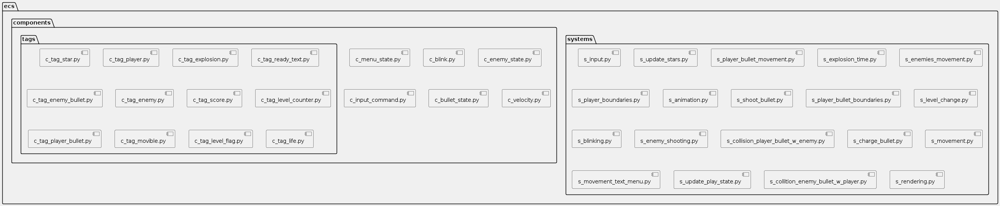
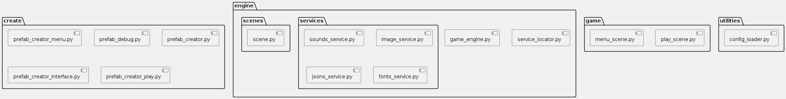
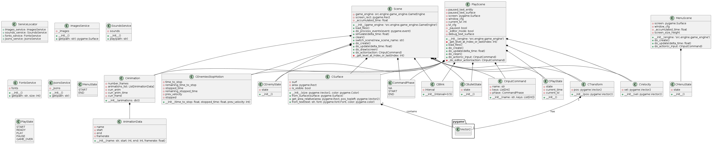

# Galaxian Jupiter

Este proyecto es un inspiracion del juego Galaxian de la consola NES. Se ha desarrollado utilizando principalmente Pygame y Esper, aplicando el patrón de arquitectura de software ECS (Entity Component System).

## Diagrama de componentes




# Diagrama de clases

Gran parte de la estructura del proyecto se basa en el patrón ECS, por lo que el diagrama de clases se centra en las clases que representan las entidades, componentes y sistemas del juego.



## Estructura del Proyecto

El proyecto tiene la siguiente estructura de directorios:

```
├── assets
│   ├── cfg = archivos de configuración en formato JSON
│   ├── fnt = fuentes de texto
│   ├── img = imágenes y sprites
│   └── snd = recursos de audio
├── esper
├── files = archivos complementarios como imágenes para documentación del proyecto
├── src = código fuente
│   ├── create = funciones de creación de entidades
│   ├── ecs
│   │   ├── components = componentes de entidades
│   │   ├── tags = tags de entidades
│   │   └── systems = sistemas de entidades
│   ├── engine
│   │   ├── scenes = escenas del juego
│   │   └── services = servicios del juego
│   └── game = escenas del juego
└── utilities = utilidades
```

## Cómo ejecutar el proyecto

Para ejecutar el proyecto, primero instala las dependencias con pip:

```bash
pip install -r requirements.txt
```

Luego, puedes ejecutar el juego con:

```bash
python main.py
```

## Juego en línea

Puedes jugar a la versión en línea del juego en [este enlace](https://rockwin.itch.io/galaxian-jupiter).
